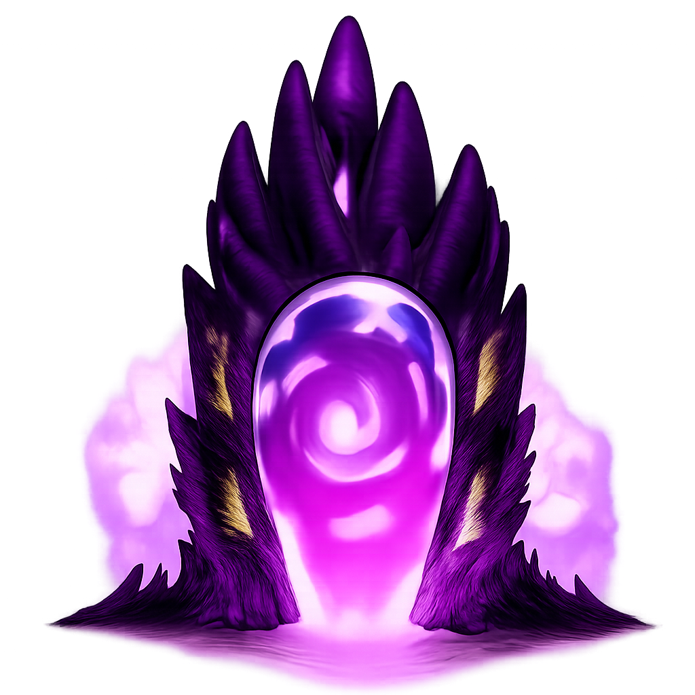

<div align="center">



# 🎮 GamePortal

**Your Gateway to Every Free Game**

[](https://nextjs.org/)
[](https://reactjs.org/)
[](https://www.typescriptlang.org/)
[](https://tailwindcss.com/)

[🌐 Live Demo](https://gameportal-next.netlify.app/) • [📖 Documentation](#-features) • [🚀 Getting Started](#-getting-started)

</div>

---

## 📋 Table of Contents

- [About](#-about)
- [Features](#-features)
- [Project Structure](#-project-structure)
- [Getting Started](#-getting-started)
- [Technologies](#-technologies)
- [API Integration](#-api-integration)
- [Deployment](#-deployment)
- [License](#-license)

## 🎯 About

**GamePortal** is a modern, full-featured web application that serves as your ultimate destination for discovering and playing free-to-play games across multiple platforms. Built with Next.js 16 and React 19, it provides a seamless, responsive experience for browsing hundreds of games with advanced filtering, search capabilities, and detailed game information.

### Key Highlights

- 🎮 **Extensive Game Library**: Browse through hundreds of free-to-play games
- 🔍 **Advanced Search & Filtering**: Find games by platform, genre, and popularity
- 📱 **Fully Responsive**: Optimized for Desktop, Tablet, and Mobile devices
- ⚡ **Server-Side Rendering**: Fast page loads with Next.js App Router
- 🎨 **Modern UI/UX**: Beautiful dark-themed interface with smooth animations
- 📊 **Detailed Game Pages**: Complete information including screenshots and system requirements

## ✨ Features

### Core Functionality

- **Game Discovery**
  - Trending games section
  - Latest releases
  - Top-rated games
  - Platform-specific collections (PC & Browser)
  - Curated game gallery with animations

- **Search & Filter**
  - Real-time search functionality
  - Filter by platform (PC, Browser)
  - Filter by genre/category
  - Sort by popularity, release date, alphabetical, or relevance
  - Advanced tag-based filtering

- **Game Details**
  - Comprehensive game information
  - Screenshot galleries
  - System requirements (for PC games)
  - Direct links to play games
  - Publisher and developer information

- **User Experience**
  - Smooth page transitions
  - Responsive navigation
  - Loading states and error handling
  - SEO-optimized pages with dynamic metadata
  - Accessible design patterns

## 📁 Project Structure

```
gameportal/
├── app/                          # Next.js App Router directory
│   ├── api/                      # API integration layer
│   │   └── fetcher.ts            # FreeToGame API client functions
│   ├── components/               # Reusable UI components
│   │   ├── assets.tsx           # Footer and other assets
│   │   ├── BackButton.tsx       # Navigation back button
│   │   ├── Gallery.tsx          # Animated game gallery component
│   │   ├── GameCard.tsx         # Game card component for sections
│   │   ├── Navbar.tsx           # Main navigation bar
│   │   └── SearchBar.tsx        # Search input component
│   ├── GameDetails/              # Game detail pages
│   │   └── [GameID]/
│   │       └── page.tsx          # Dynamic game detail page
│   ├── Gameportal/               # Main games portal page
│   │   ├── components/
│   │   │   ├── FilterSidebar.tsx # Filter sidebar component
│   │   │   ├── GameGrid.tsx     # Games grid layout
│   │   │   └── PortalGameCard.tsx # Game card for portal view
│   │   └── page.tsx              # Games portal page with filters
│   ├── Search/                   # Search results page
│   │   └── page.tsx              # Search page component
│   ├── globals.css               # Global styles and Tailwind config
│   ├── layout.tsx                # Root layout with metadata
│   ├── page.tsx                  # Home page component
│   └── favicon.ico               # Site favicon
├── public/                       # Static assets
│   ├── character/                # Character images for gallery
│   ├── logo.png                  # GamePortal logo
│   └── grok-video-*.mp4          # Background video assets
├── next.config.ts                # Next.js configuration
├── tsconfig.json                 # TypeScript configuration
├── package.json                  # Project dependencies
├── eslint.config.mjs             # ESLint configuration
├── postcss.config.mjs            # PostCSS configuration
└── README.md                     # Project documentation
```

## 🚀 Getting Started

### Prerequisites

Make sure you have the following installed on your system:

- **Node.js** (v18 or higher)
- **npm**, **yarn**, or **pnpm** package manager

### Installation

1. **Clone the repository**
   ```bash
   git clone https://github.com/yourusername/gameportal.git
   cd gameportal
   ```

2. **Install dependencies**
   ```bash
   npm install
   # or
   yarn install
   # or
   pnpm install
   ```

3. **Run the development server**
   ```bash
   npm run dev
   # or
   yarn dev
   # or
   pnpm dev
   ```

4. **Open your browser**
   
   Navigate to [http://localhost:3000](http://localhost:3000) to see the application.

### Build for Production

```bash
npm run build
npm start
```

## 💻 Technologies

### Core Framework & Libraries

- **[Next.js 16.0.8](https://nextjs.org/)** - React framework with App Router
- **[React 19.2.1](https://reactjs.org/)** - UI library
- **[TypeScript 5](https://www.typescriptlang.org/)** - Type-safe JavaScript
- **[Tailwind CSS 4](https://tailwindcss.com/)** - Utility-first CSS framework

### Additional Libraries

- **[Framer Motion 12.23.26](https://www.framer.com/motion/)** - Animation library for React
- **[React Icons 5.5.0](https://react-icons.github.io/react-icons/)** - Icon library

### Development Tools

- **ESLint** - Code linting
- **PostCSS** - CSS processing
- **TypeScript** - Static type checking

## 🔌 API Integration

GamePortal integrates with the **[FreeToGame API](https://www.freetogame.com/api-doc)** to fetch game data. The API client is implemented in `app/api/fetcher.ts` and provides:

### Available Functions

- `getAllGames()` - Fetch all games
- `getGamesByPlatform(platform)` - Filter by platform (PC/Browser)
- `getGamesByCategory(category)` - Filter by game category
- `getGamesSorted(sortBy)` - Sort games by criteria
- `getGamesWithFilters(params)` - Advanced filtering
- `getGameById(id)` - Get detailed game information
- `getTrendingGames()` - Get trending games
- `getLatestReleases()` - Get latest releases
- `getPCGames()` - Get PC games only
- `getBrowserGames()` - Get browser games only

### API Features

- Type-safe API responses with TypeScript interfaces
- Error handling and fallbacks
- Query parameter building utilities
- Support for multiple filter combinations

## 🚢 Deployment

The project is configured for deployment on **Netlify** and is currently live at:

**🌐 [https://gameportal-next.netlify.app/](https://gameportal-next.netlify.app/)**

### Deployment Platforms

- **Netlify** (Current) - Automatic deployments from Git
- **Vercel** - Recommended for Next.js projects
- **Other Platforms** - Any platform supporting Next.js

### Environment Variables

No environment variables are required for this project as it uses a public API.

## 📄 License

This project is licensed under the [MIT License](LICENSE).

---

<div align="center">

**Made with ❤️ by the GamePortal Team**

[🌐 Live Site](https://gameportal-next.netlify.app/) • [📧 Contact](#) • [🐛 Report Bug](#) • [💡 Request Feature](#)

</div>
